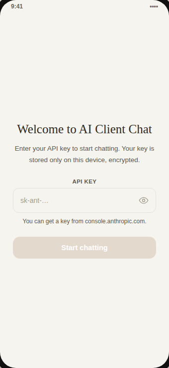
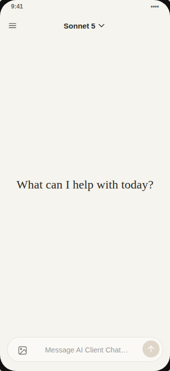
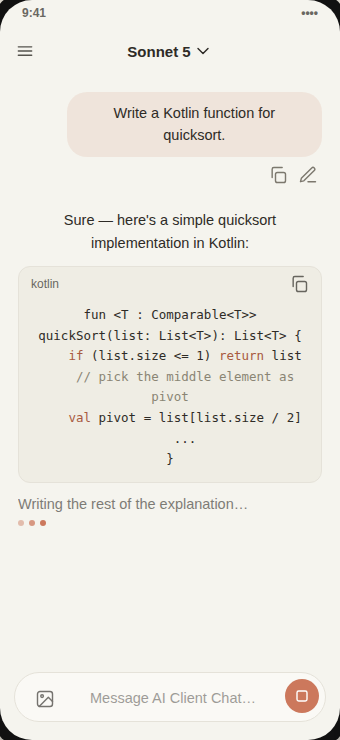
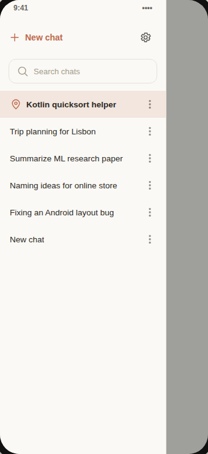
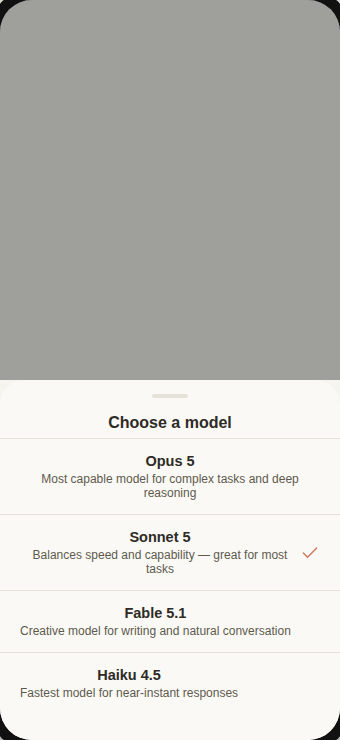
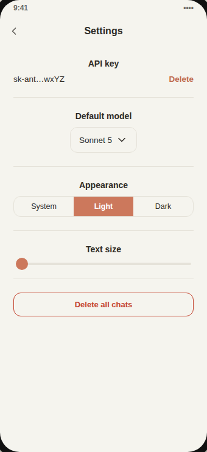
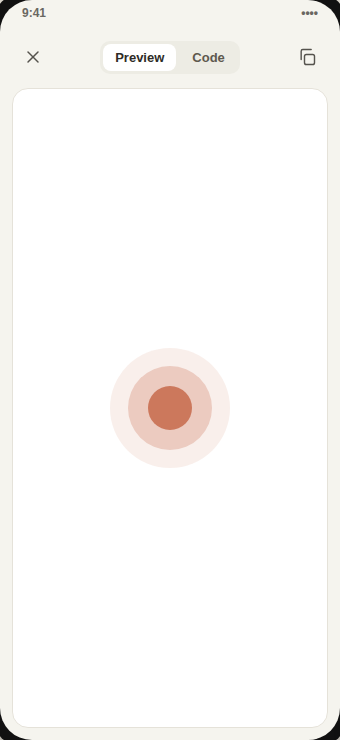
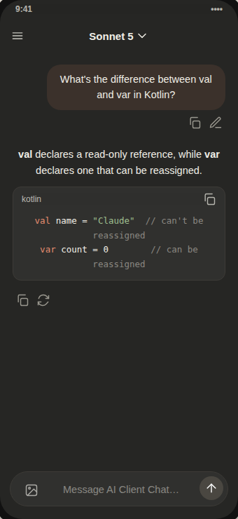

# AI Client Chat

A native Android app (Kotlin + Jetpack Compose) that delivers a chat experience modeled after Claude's look and feel, connecting directly to the Anthropic API with your own API key (BYOK — Bring Your Own Key). There is no backend server in between; your key is stored only on your device, encrypted.

## Screenshots

|  |  |
|---|---|
|  |  |
|  |  |
|  |  |
|  |  |

> These are high-fidelity design mockups built from the app's actual colors, copy, and layout (see `docs/screenshots/design-mockup.html`) — not screenshots captured from a running build, since this development environment has no Android SDK/emulator available. Build and run the app per the guide below to see it on a real device.

## Features

- Look and color palette inspired by Claude (light/dark themes with a signature clay/terracotta accent)
- Streaming responses with a stop-generating control
- Local chat history (Room) with search, rename, pin, and delete
- Image attachments (multimodal/vision)
- Full markdown rendering (headings, lists, tables, quotes, links) plus syntax-highlighted, copyable code blocks
- HTML/SVG "artifact" preview in an in-app WebView
- Edit a sent message and regenerate the assistant's response
- Model picker (Opus / Sonnet / Fable / Haiku) with a per-chat system prompt and other settings

## Tech stack

Kotlin, Jetpack Compose (Material 3), Room, DataStore + EncryptedSharedPreferences, OkHttp (hand-rolled SSE streaming for the Anthropic Messages API), kotlinx.serialization, Markwon.

## Build & run

See [`BUILD_APK_FA.md`](./BUILD_APK_FA.md) for a full step-by-step guide (in Persian) to opening the project in Android Studio, syncing Gradle, and producing debug/signed release APKs.

## Privacy

This app has no dedicated backend. Requests go straight from your phone to `api.anthropic.com`, and your API key is kept only in encrypted storage on that same device.

## Limitations vs. the official Claude app

This is an independent, unofficial client. Some official-app features — Projects, voice mode, live web search, or interactive Artifact execution — are not implemented here and could be added in the future.
